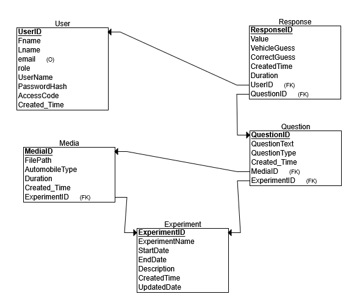

# VehicleSound-AnnoyanceSurveyApp

A web-based application to collect and analyze human perception of vehicle sound annoyance.

## Project Overview

This app allows users to listen to vehicle sounds (car, motorcycle, truck or other), classify them, and rate their loudness(annoyance level). Responses are stored for further analysis.

## Technology Stack

- **Backend:** Python (Flask)
- **Frontend:** HTML, CSS
- **Database:** MySQL
- **Data Analysis:** Python (Pandas, NumPy)
## User Roles
- Administrator: 
    - Has complete access to all features and resources.
    - Able to manage users, generate reports, and configure system settings.
- Standard User: 
    - Can access and interact with resources. 
    - Does not have permission to modify configurations or manage other users.

## User Credentials
- Users authenticate using their email address and password.
- Email: Serves as a unique identifier for each user.
- Password: Must be at least ?? characters long.
- The password is securely stored by hashing it with MD5.

## Authentication Process
- Registration: Users create an account by providing their email and setting a password.
- The system ensures the password meets the minimum length of 3 characters and is re-entered correctly to prevent errors.
- Passwords are hashed using MD5 before they are stored in the database for security.
- Login: Users log in by entering their email and password.
- The system validates the email and compares the entered password with the MD5 hashed password stored in the database.
- If the credentials are correct, a session is created to track the user’s activity throughout their session.
## Session Management:
- Upon successful login, a session is initiated to monitor the user's interactions with the application.
- If the session remains inactive for a specified time, the user will be automatically logged out to ensure security.

## Relational diagram

